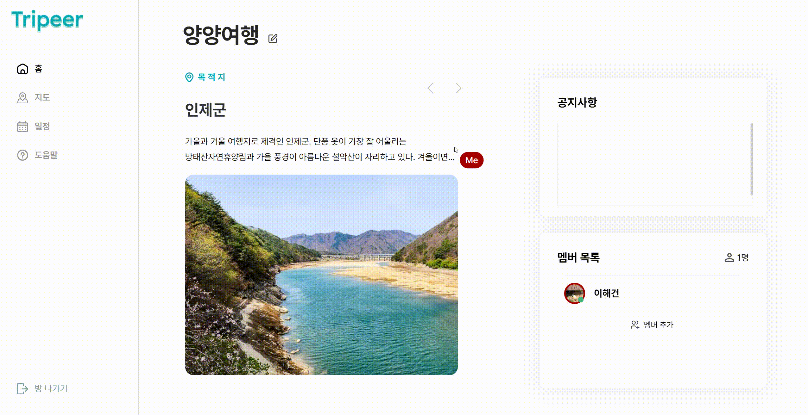

<div align="center">
      

 <h1>Tripeer</h1>

 <h3>편리한 의견공유 기능을 탑재한 여행 플래너</h3>
<p>2024.04.08 ~ 2024.05.20</p>
</div>


## 목차

- 서비스 개요
- 팀원 소개
- 기술 스택
- 주요 기능
- 명세서
- ERD
- 시스템 아키텍쳐
- 서비스 실사용 화면

## 서비스 개요

```
스마트하고 편리한 여행플래너 Tripeer

여러 사용자들과 화면을 공유하고 음성대화, 채팅 기능을 통해 편리하게 여행을 계획할 수 있습니다.
여행 목적지에서 여행지들을 선택하고 일정을 작성할때 실시간으로 현황 동기화가 제공되고 경로별 이동시간이 자동으로 계산됩니다.
목록만 작성하면 자동으로 최적 경로를 제공 받을 수 있습니다.
여행중에는 모바일 페이지를 통해 작성한 여행 플랜을 확인할 수 있고
지나간 여행은 지난 여행을 통해 다시 볼 수 있고 여행 사진 또한 공유할 수 있습니다.
```

## 팀원 소개
<div>
      
</div>

## 기술 스택

<center>FrontEnd

HTML5, CSS3, NODE.JS, NEXT.JS, Yjs
<center>BackEnd

JAVA, SpringBoot, SpringWebClient, Gradle, MongoDB, MySql, AMAZON S3, HIBERNATE, fastAPI, express

<center> Infra
JenKins, NginX, Docker


##  주요 기능

<table>
<tr>
 <th>분류</th>
  <th>기능</th>
   <th>내용</th>
   </tr>
   <tr>
<td> 플랜 </td>
<td>플랜 생성</td>
<td>여러 사용자들과 여행 계획을 세우기 위한 플랜을 생성합니다.</td>
</tr>
   <tr>
<td></td>
<td>공유 문서</td>
<td>플랜 페이지 내 액션 및 CRUD 현황이 공유됩니다.</td>
</tr>
   <tr>
<td></td>
<td>음성 채팅</td>
<td>플랜 진입 시 멤버들과 음성 채팅이 가능합니다.</td>
</tr>
   <tr>
<td></td>
<td>채팅</td>
<td> ` 키를 눌러 마우스 포인터 창에서 채팅 입력이 가능합니다.</td>
</tr>
<tr> 
<td> 여행 계획 세부 </td>
<td> 여행지 추가</td>
<td> 방문하고자 하는 장소를 추가 합니다. 목적지로 설정한 장소의 여행지 목록을 제공하며, 사용 기록에 따른 추천 여행지 목록도 제공합니다.</td>
</tr>
<tr> 
<td> </td>
<td> 이동 시간 계산</td>
<td> 두 목적지 간 이동 시간을 이동 수단에 따라 자동으로 계산해줍니다.</td>
</tr>
<tr> 
<td> </td>
<td> 최적 경로 자동 계산</td>
<td> 해당 일자에 등록된 목적지들로 이동 시간이 가장 짧은 경유 경로를 계산하여 제공합니다.</td>
</tr>
<tr> 
<td> </td>
<td> 여행 일정 저장 </td>
<td> 작성한 여행 일정을 저장하여 공유하고 모바일 화면으로도 볼 수 있게 해줍니다. </td>
</tr>
<tr> 
<td> 여행지</td>
<td> 여행지 검색 </td>
<td> 가고싶은 여행지를 검색하거나 추천 여행지 정보를 제공 받습니다. </td>
</tr>
<tr> 
<td> 여행 기록</td>
<td> 여행 목록 확인 </td>
<td> 여행했던 여행들의 목록, 경로들을 확인합니다 .</td>
</tr>
<tr> 
<td> </td>
<td> 사진 업로드 </td>
<td> 일자별로 사진을 업로드 하여 공유할 수 있도록 합니다. </td>
</tr>
</table>


##  명세서

- <a href='https://tested-roquefort-da8.notion.site/e0ed30ab70594efe87bcc2bd7dd66f1b?pvs=4'>기능 명세서</a>

- <a href='https://tested-roquefort-da8.notion.site/API-f79c44d8a0fd4db2873364bddbed4ba0?pvs=4'>API 명세서</a>

- <a href='https://www.figma.com/design/qweyp746luFDLaeygU22h3/D207?node-id=0%3A1&t=JYlzOiCRaGomhiGR-1'>Figma</a>


## ERD

<div>
      
</div>

## 시스템 아키텍쳐

<div>
      
</div>

## 서비스 실사용 화면

- 계획추가
      
- 멤버초대
      
- 장소선택
      
- 추천 여행지 선택
      
- 여행 계획 세우기
      
- 최단거리 계산
      
- 온라인 유저 확인하기, 메모하기, 공지사항 입력
- 경로 보기
- 여행 계획으로 보기
      
- 지난 여행 보기
- 사진 업로드
