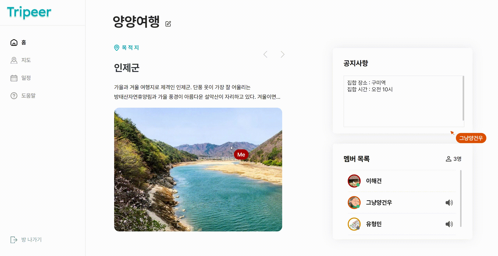
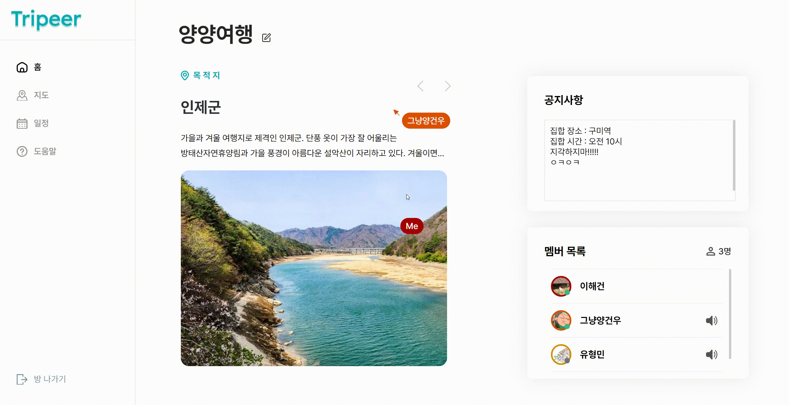

<div align="center">
      

 <h1>Tripeer</h1>

 <h3>실시간 일정 조율 가능한 여행 협업 플래너</h3>
<p>2024.04.08 ~ 2024.05.20</p>
</div>

## 목차

- [목차](#목차)
- [서비스 개요](#서비스-개요)
- [팀원 소개](#팀원-소개)
- [기술 스택](#기술-스택)
- [주요 기능](#주요-기능)
- [명세서](#명세서)
- [ERD](#erd)
- [시스템 아키텍쳐](#시스템-아키텍쳐)
- [서비스 실사용 화면](#서비스-실사용-화면)
  - [1. 메인 페이지](#1-메인-페이지)
  - [2. 일정 계획 페이지](#2-일정-계획-페이지)
    - [2-1. 여행 계획 홈 메뉴](#2-1-여행-계획-홈-메뉴)
    - [2-2. 여행 계획 지도 메뉴](#2-2-여행-계획-지도-메뉴)
    - [2-3. 여행 계획 일정 메뉴](#2-3-여행-계획-일정-메뉴)
  - [3. 지난 계획 페이지](#3-지난-계획-페이지)
  - [4. 여행지 페이지](#4-여행지-페이지)
    - [5. 공통화면](#5-공통화면)

## 서비스 개요

```
스마트하고 편리한 여행플래너 Tripeer

여러 사용자들과 화면을 공유하고 음성대화, 채팅 기능을 통해 편리하게 여행을 계획할 수 있습니다.
여행 목적지에서 여행지들을 선택하고 일정을 작성할때 실시간으로 현황 동기화가 제공되고 경로별 이동시간이 자동으로 계산됩니다.
목록만 작성하면 자동으로 최적 경로를 제공 받을 수 있습니다.
여행중에는 모바일 페이지를 통해 작성한 여행 플랜을 확인할 수 있고
지나간 여행은 지난 여행을 통해 다시 볼 수 있고 여행 사진 또한 공유할 수 있습니다.
```

## 팀원 소개

<div align="center">
      
      <table>
      <tr>
        <td align="center" width="5%">GitHub</td>
        <td align="center" width="15%"><a href="https://github.com/suehwanBoo">부수환</a></td>
        <td align="center" width="15%"><a href="https://github.com/hyunjiihye">현지혜</td>
        <td align="center" width="15%"><a href="https://github.com/lhgeer7485">이해건</td>
        <td align="center" width="15%"><a href="https://github.com/YangGeoun">양건우</td>
        <td align="center" width="15%"><a href="https://github.com/sondongcheon">손동천</td>
        <td align="center" width="15%"><a href="https://github.com/hyyoom">유형민</td>
        </tr>
      </table>
</div>

## 기술 스택

<div align="middle">

**| FrontEnd |**


<br>

**Language |** HTML5, CSS3, JavaScript, node.js(v20.12.2)

**Framework |** Next.js(v14.2.2), Zustand(v4.5.2)

**Library |** eslint(v8.57.0), Yjs(v13.6.14), prettier(v3.2.5), Lottie(v2.0.0), Axios(v1.6.7), peer.js(v1.5.2)

</div>

<br>
<br>
<div align="middle">

**| BackEnd |**

 


</br>

**Language |** Java 21, Python (v3.9.13)

**Framework |** Spring Boot(v3.2.4), express(v4.19.2), fastAPI(v0.111.0)

**DB Connection(ORM) |** Spring Data JPA

**Build Tool |** Gradle(v8.5.0)

</div>

<br>
<br>
<div align="middle">

**| Infra |**

 
 


<br>

**DB |** MySQL(v8.0.22), MongoDB(v7.0.8)

**Server |** GitLab, Jenkins(v2.440.3), Docker(v25.0.2), Nginx(v1.18.0)

</div>

## 주요 기능

<table>
<tr>
  <th>분류</th>
  <th>기능</th>
  <th>내용</th>
</tr>
<tr>
  <td> 플랜 </td>
  <td>플랜 생성</td>
  <td>여러 사용자들과 여행 계획을 세우기 위한 플랜을 생성합니다.</td>
</tr>
<tr>
  <td></td>
  <td>공유 문서</td>
  <td>플랜 페이지 내 액션 및 CRUD 현황이 공유됩니다.</td>
</tr>
<tr>
  <td></td>
  <td>맴버 초대</td>
  <td>여행을 갈 멤버들에게 초대 이메일을 보냅니다.</td>
</tr>
<tr>
  <td></td>
  <td>음성 채팅</td>
  <td>플랜 진입 시 멤버들과 음성 채팅이 가능합니다.</td>
</tr>
<tr>
  <td></td>
  <td>채팅</td>
  <td> ` 키를 눌러 마우스 포인터 창에서 채팅 입력이 가능합니다.</td>
</tr>
<tr> 
  <td> 여행 계획 세부 </td>
  <td> 여행지 추가</td>
  <td> 방문하고자 하는 장소를 추가 합니다. 목적지로 설정한 장소의 여행지 목록을 제공하며, 사용 기록에 따른 추천 여행지 목록도 제공합니다.</td>
</tr>
<tr> 
  <td> </td>
  <td> 이동 시간 계산</td>
  <td> 두 목적지 간 이동 시간을 이동 수단에 따라 자동으로 계산해줍니다.</td>
</tr>
<tr> 
  <td> </td>
  <td> 최적 경로 자동 계산</td>
  <td> 해당 일자에 등록된 목적지들로 이동 시간이 가장 짧은 경유 경로를 계산하여 제공합니다.</td>
</tr>
<tr> 
  <td> </td>
  <td> 여행 일정 저장 </td>
  <td> 작성한 여행 일정을 저장하여 공유하고 모바일 화면으로도 볼 수 있게 해줍니다. </td>
</tr>
<tr> 
  <td> 여행지</td>
  <td> 여행지 검색 </td>
  <td> 가고싶은 여행지를 검색하거나 추천 여행지 정보를 제공 받습니다. </td>
</tr>
<tr> 
  <td> 여행 기록</td>
  <td> 여행 목록 확인 </td>
  <td> 여행했던 여행들의 목록, 경로들을 확인합니다 .</td>
</tr>
<tr> 
  <td> </td>
  <td> 사진 업로드 </td>
  <td> 일자별로 사진을 업로드 하여 공유할 수 있도록 합니다. </td>
</tr>
</table>

## 명세서

<div align="start">

- <a href='https://tested-roquefort-da8.notion.site/e0ed30ab70594efe87bcc2bd7dd66f1b?pvs=4'>기능 명세서</a>

- <a href='https://tested-roquefort-da8.notion.site/API-f79c44d8a0fd4db2873364bddbed4ba0?pvs=4'>API 명세서</a>

- <a href='https://www.figma.com/design/qweyp746luFDLaeygU22h3/D207?node-id=0%3A1&t=JYlzOiCRaGomhiGR-1'>Figma</a>
</div>

## ERD

<div  width="70%">
      
</div>

## 시스템 아키텍쳐

<div  width="70%">
      
</div>

## 서비스 실사용 화면

### 1. 메인 페이지

<table>
    <tr>
        <th>메인 페이지(서비스 처음 화면)</th>
    </tr>
    <tr>
        <td></td>
    </tr>
</table>
<br>

### 2. 일정 계획 페이지

#### 2-1. 여행 계획 홈 메뉴

<table>
    <tr>
        <th>계획 생성</th>
    </tr>
    <tr>
        <td></td>
    </tr>
</table>
<br>

<table>
    <tr>
        <th>멤버 초대</th>
    </tr>
    <tr>
        <td></td>
    </tr>
</table>
<table>
    <tr>
        <th>멤버 초대 이메일</th>
    </tr>
    <tr>
        <td></td>
    </tr>
</table>
<br>

<table>
    <tr>
        <th>공지사항 작성</th>
    </tr>
    <tr>
        <td></td>
    </tr>
</table>
<br>

<table>
    <tr>
        <th>마우스 커서 공유 및 채팅</th>
    </tr>
    <tr>
        <td></td>
    </tr>
</table>
<br>

#### 2-2. 여행 계획 지도 메뉴

<table>
    <tr>
        <th>여행지 선택</th>
    </tr>
    <tr>
        <td></td>
    </tr>
</table>
<br>

<table>
    <tr>
        <th>추천 여행지 선택</th>
    </tr>
    <tr>
        <td></td>
    </tr>
</table>
<br>

<table>
    <tr>
        <th>여행지 상세 보기</th>
    </tr>
    <tr>
        <td></td>
    </tr>
</table>
<br>

<table>
    <tr>
        <th>신규 장소 등록</th>
    </tr>
    <tr>
        <td></td>
    </tr>
</table>
<br>

#### 2-3. 여행 계획 일정 메뉴

<table>
    <tr>
        <th>여행 일정 조율</th>
    </tr>
    <tr>
        <td></td>
    </tr>
</table>
<br>

<table>
    <tr>
        <th>최단 거리 계산</th>
    </tr>
    <tr>
        <td></td>
    </tr>
</table>
<br>

<table>
    <tr>
        <th>경로 보기</th>
    </tr>
    <tr>
        <td></td>
    </tr>
</table>
<br>

<table>
    <tr>
        <th>도움말</th>
    </tr>
    <tr>
        <td></td>
    </tr>
</table>
<br>

<table>
    <tr>
        <th>완성된 여행 계획(pc버전)</th>
         <th>완성된 여행 계획(모바일 버전)</th>
    </tr>
    <tr>
        <td></td>
        <td></td>
    </tr>
</table>
<br>

### 3. 지난 계획 페이지

<table>
    <tr>
        <th>지난 여행 계획</th>
    </tr>
    <tr>
        <td></td>
    </tr>
</table>
<br>

### 4. 여행지 페이지

<table>
    <tr>
        <th>여행지 리스트</th>
    </tr>
    <tr>
        <td></td>
    </tr>
</table>
<br>

<table>
    <tr>
        <th>여행지 디테일</th>
    </tr>
    <tr>
        <td></td>
    </tr>
</table>
<br>

#### 5. 공통화면

<table>
    <tr>
        <th>회원가입</th>
    </tr>
    <tr>
        <td></td>
    </tr>
</table>
<br>

<table>
    <tr>
        <th>로그인</th>
    </tr>
    <tr>
        <td></td>
    </tr>
</table>
<br>

<table>
    <tr>
        <th>회원정보 수정</th>
    </tr>
    <tr>
        <td></td>
    </tr>
</table>
<br>

<table>
    <tr>
        <th>404 페이지</th>
    </tr>
    <tr>
        <td></td>
    </tr>
</table>
<br>
